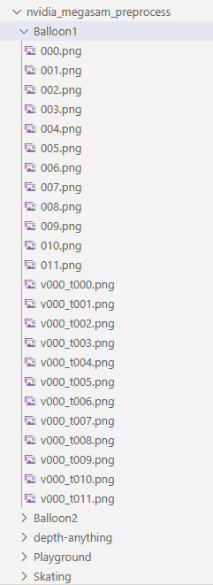

## 如何使用
1.另起一个文件夹，将所需数据集的每个场景测试图像+训练图像放在同一文件夹下。注意命名，使其按名称排序时训练图像在前，测试图像在后



2.将这些数据运行[megasam](https://github.com/mega-sam/mega-sam)，你会得到：

（1）depthanything文件夹下的输出

（2）unidepth文件夹下的输出

（3）在mega-sam/outputs_cvd下的最终输出（如Balloon1_sgd_cvd_hr.npz），用作相机位姿

3.运行[splineGS](https://github.com/KAIST-VICLab/SplineGS)的初始化，然后使用2中得到的结果进行替换：

（1）将megasam的depthanything训练集结果复制到splineGS对应的depth-anything文件夹下（如/share/czh/nvidia_rodynrf/Balloon1/depth_anything）。删除掉训练集的depth-anything结果。

（2）转换megasam输出的unidepth的格式：先删掉splineGS对应的unidepth文件夹下内容；然后修改test/convert_unidepth.py 开头的IN_ROOT和OUT_ROOT，运行。删除掉测试集的unidepth结果。

（3）替换相机位姿：在train.py的line 1181，将npz_path修改为你使用megasam得到的npz路径。line1186-1187，根据数据集大小替换数字。

4.按照splineGS的步骤进行训练与测试，例如：

```
python train.py -s /share/czh/nvidia_rodynrf/Balloon1/ --expname "Balloon1" --configs arguments/nvidia_rodynrf/Balloon1.py

python eval_nvidia.py -s /share/czh/nvidia_rodynrf/Balloon1/ --expname "Balloon1" --configs arguments/nvidia_rodynrf/Balloon1.py --checkpoint output/Balloon1/point_cloud/fine_best
```
## TODO
1. 发现splineGS测的PSNR等数据不是mask的，之后会修改并重新测试
